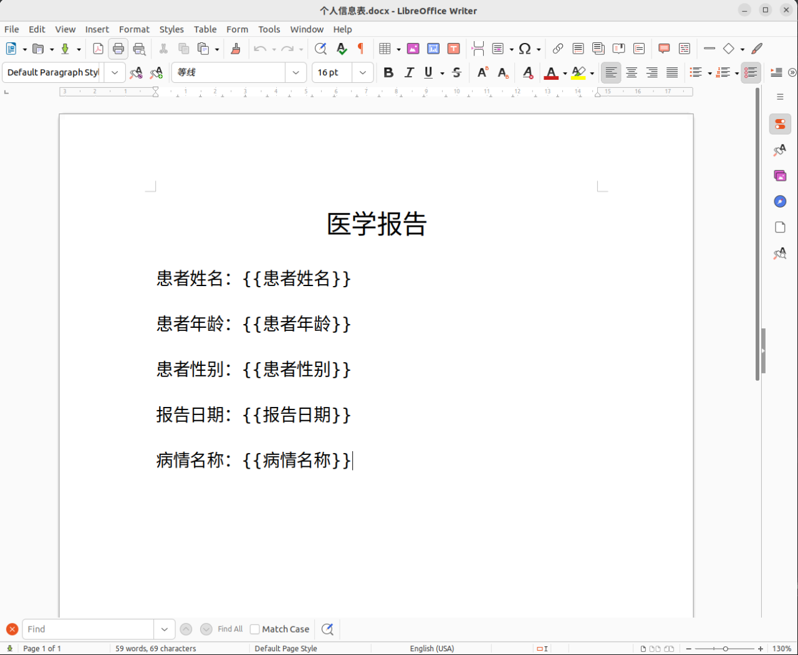
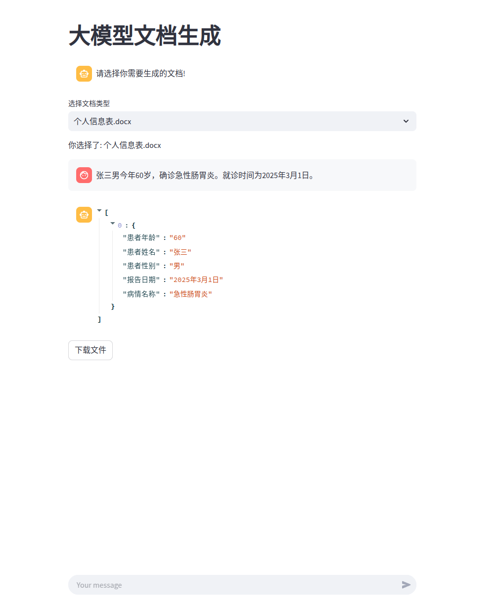
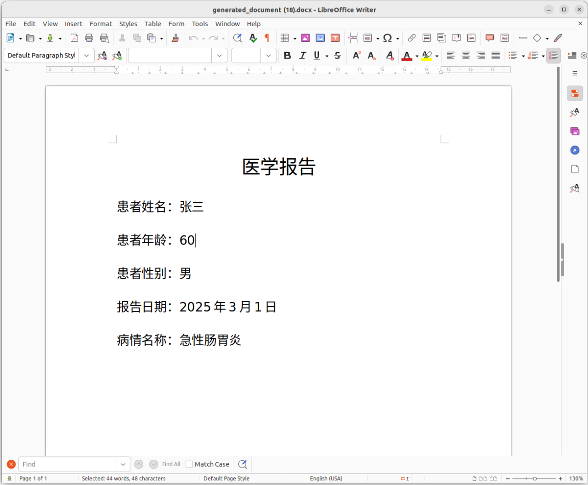

# Word-Generation-By-LLM
# 通过Langchain进行文档生成。

代码还写得不是那么好，后续继续优化（3.26）。


## Example








## 生成步骤

1、手动做一个word模板，并且将需要填写的数据通过jinjia2语法进行占位。

2、输如一段本文，通过Langchain结构提取将本文中的关键信息进行提取，输出json格式数据。

3、将提取到的关键信息通过jinjia2语法填入word。


## USE

1、安装依赖

```
conda create -n WG_env python=3.10
conda activate WG_env
```


```
pip install -r requirements.txt -i https://pypi.tuna.tsinghua.edu.cn/simple
```

2、运行

```
streamlit run 1_文档生成.py
```